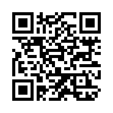
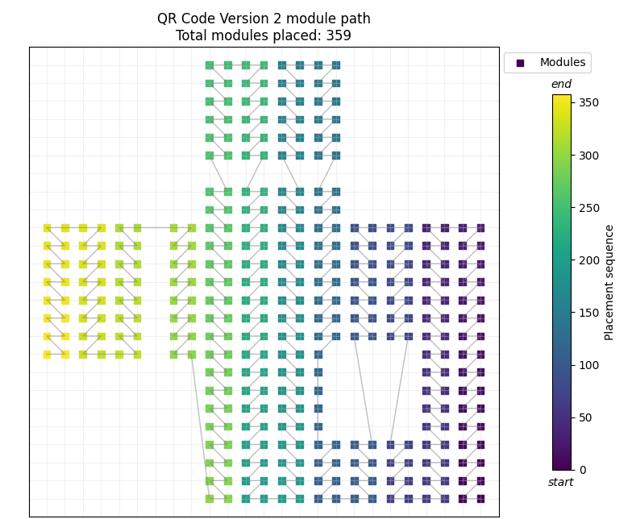

# Command-line QR Code generator
[](https://www.iso.org/standard/83389.html)
[](https://github.com/oAGoulart/qrcode/releases)
[](https://github.com/oAGoulart/qrcode/tree/master?tab=MS-RL-1-ov-file)
[](https://doi.org/10.5281/zenodo.15851589)

**Features:** Model 2 byte/num/alpha modes, as specified in ISO/IEC 18004:2024.
There are no dependencies, generator can be built from code on any platform. Outputs inline (stdout), bitmap, or vectors (svg).

**Available generation and capacity (codewords):**

|   Version | 1  | 2  | 3  | 4  | 5   | 6   | 7   | 8   | 9   | 10  | 11  | 12  | 13  | 14  | 15  | 16  | 17  | 18  | 19  | 20  | 21  | 22   | 23   | 24   | 25   | 26   | 27   | 28   | 29   | 30   | 31   | 32   | 33   | 34   | 35   | 36   | 37   | 38   | 39   | 40   |
|------------------------:|:---:|:---:|:---:|:---:|:---:|:---:|:---:|:---:|:---:|:---:|:---:|:---:|:---:|:---:|:---:|:---:|:---:|:---:|:---:|:---:|:---:|:----:|:----:|:----:|:----:|:----:|:----:|:----:|:----:|:----:|:----:|:----:|:----:|:----:|:----:|:----:|:----:|:----:|:----:|:----:|
| Low       | 17 | 32 | 53 | 78 | 106 | 134 | 154 | 192 | 230 | 271 | 321 | 367 | 425 | 458 | 520 | 586 | 644 | 718 | 792 | 858 | 929 | 1003 | 1091 | 1171 | 1273 | 1367 | 1465 | 1528 | 1628 | 1732 | 1840 | 1952 | 2068 | 2188 | 2303 | 2431 | 2563 | 2699 | 2809 | 2953 |
| Medium    | 14 | 26 | 42 | 62 | 84  | 106 | 122 | 152 | 180 | 213 | 251 | 287 | 331 | 362 | 412 | 450 | 504 | 560 | 624 | 666 | 711 | 779  | 857  | 911  | 997  | 1059 | 1125 | 1190 | 1264 | 1370 | 1452 | 1538 | 1628 | 1722 | 1809 | 1911 | 1989 | 2099 | 2213 | 2331 |
| Quartile  | 11 | 20 | 32 | 46 | 60  | 74  | 86  | 108 | 130 | 151 | 177 | 203 | 241 | 258 | 292 | 322 | 364 | 394 | 442 | 482 | 509 | 565  | 611  | 661  | 715  | 751  | 805  | 868  | 908  | 982  | 1030 | 1112 | 1168 | 1228 | 1283 | 1351 | 1423 | 1499 | 1579 | 1663 |
| High      | 7  | 14 | 24 | 34 | 44  | 58  | 64  | 84  | 98  | 119 | 137 | 155 | 177 | 194 | 220 | 250 | 280 | 310 | 338 | 382 | 403 | 439  | 461  | 511  | 535  | 593  | 625  | 658  | 698  | 742  | 790  | 842  | 898  | 958  | 983  | 1051 | 1093 | 1139 | 1219 | 1273 |

> [!NOTE]
> Generator will auto-select lowest Version possible.
> Unless option `-V` is specified.\
> Each **codeword** refers to a full byte (8 bits).\
> Numeric encoding uses up to 10-bits for 3 digits (~58% reduction).\
> Alphanumeric encoding uses up to 11-bits for each pair of characters (~31% reduction).

**Pre-generated lookup tables:**
1. Reed-Solomon error correction generator polynomials.
2. Galois field of 256 (285 primitive) log and anti-log table.
3. Placement index of each module onto the encoding region.
4. QR Code Format and Version information tables.
5. QR Code Group/Block information table.

## Usage

**Options available:**

```text
Usage: qrcode [OPTIONS] <data to encode>
OPTIONS:
  -h, --help     show this help message
  --nolimit      ignore inline Version limit (for larger terminals)
  --optimize     reduce data size, encode numeric, alphanumeric, byte
                   segments separately (if any)
  --raw          print generated code with chars 1, 0 (no box-chars)
  -v, --version  show generator's version and build information
  -g <uint>      level of on-screen information <0-3>
  -l <char>      use a specific error correction level (l, m, q, or h)
  -m <uint>      force use of mask <0-7>, regardless of penalty
  -s <uint>      scale image output <1-30> times
  -V <uint>      force use of version <1-40> code (or lower, if
                   used with --optimize)
  -B <string>    create bitmap file with generated code
  -K <string>    create scalable vector image, disregards -s
```

### Building and binaries

Latest (stable) release can be found at this repo's [Releases](https://github.com/oAGoulart/qrcode/releases).
To build this project, use `make`. Otherwise, as long as your system has
Clang and Python, you may run Makefile's `build` commands manually.

> [!CAUTION]
> **Beware 1:** This repo's `master` branch may or may not contain uncompilable, unstable code.
> It's recommended that you select the latest tag release,
> unless you wish to collaborate with code.
>
> **Beware 2:** Whilst building, scripts will generate +2MB of pre-calculated lookup tables. That process should take less than 10s.
>
> **Beware 3:** If using LUT script in debug, make sure `matplotlib` is properly installed. If needed, activate a virtual envionment before executing `make`. With MinGW, make sure to use `pacman` instead of `pip`.

**Build tools used for binaries:**

|     Tool |  |  |  |  |  |
|---------:| :----: | :----: | :----: | :----: | :----: |
| GNU Make | 4.3 | 4.4.1 | 4.4.1* | 4.4.1* | 4.4.1* |
|    Clang | 14.0.0 | 21.1.8 | 19.1.7 | 17.0.0 | 20.1.7 |
|   Python | 3.10.12 | 3.14.3 | 3.11.13 | 3.14.3 | 3.13.3 |
| *status* | 🟩 | 🟩 | 🟩 | 🟩 |  🟩 |

\* Use `gmake` instead of system-provided `make`.

### Examples

#### 1. Inline printing

**Command-line:** 
```bash
qrcode oagoulart.github.io/rambles/keep-thyself-credible
```

**Output:**
```bash

    █▀▀▀▀▀█ ▄█  █▄▀▄█▀▀▀█ █▀▀▀▀▀█
    █ ███ █ ▄█  █▄█▀▄▄    █ ███ █
    █ ▀▀▀ █ ▄█  ▀ ▄▄▀▄█▀▀ █ ▀▀▀ █
    ▀▀▀▀▀▀▀ ▀▄▀ ▀ █▄▀ █▄▀ ▀▀▀▀▀▀▀
    █████ ▀█▀█ ▄▀█▀ ▄█▄▄█▀▄█▄█▄█▄
    ▄██▀ ▀▀ ██  ▀ ▀█▄ ▄▄█▄ ▀▀█▀ ▄
    ▄▀▄ █ ▀▀ ▀ █▀▀▀▀█▀▄█ ▄▄▄▄█▀▄▄
     ▀  ▀ ▀▀█▄▄▄█▀▀██  ▄██▀█▄█   
    ▄▄▀▀█ ▀█ ▀█▄▀█   ▀ █▄ ▄▄▄▄██▄
    █ █▄██▀█▄▄▄ ▄ ██ ▀▀ ▀  ▄ ▄  ▄
    ▀  ▀▀▀▀▀█▄ █▀▀▀▀███▀█▀▀▀█ ▀▄█
    █▀▀▀▀▀█ ▀█  ▀▀▄██▀ ██ ▀ ██   
    █ ███ █ ██▀▄▀▀█▀▄█▄ █▀▀▀▀▀▀▀▄
    █ ▀▀▀ █ █▄▀  ▀ ██▀▀▀██▀ █▄▀█ 
    ▀▀▀▀▀▀▀ ▀▀▀ ▀▀▀▀ ▀   ▀▀▀▀▀▀  

```

> [!TIP]
> Using a `line-height` of `1em` (i.e. line height is equal to font size)
> will remove the unintended vertical spacing seen in the output above.
> Some fonts may require a slight different value between `1 +/- .25`.
> You can also try value `normal`.

#### 2. Bitmap generation

**Command-line:** 
```bash
qrcode -s 6 -B gen.bmp oagoulart.github.io/rambles/keep-thyself-credible
```

**Output:**



#### 3. Vector graphics generation

**Command-line:** 
```bash
qrcode -K gen.svg oagoulart.github.io/rambles/keep-thyself-credible
```

**Output:**


### Module path visualizer

If you wish to visualize how modules are placed onto the encoding region, you can use the generator script at `scripts/indexes.py` in debug mode. An usage example with MinGW is:

```sh
pacman -S mingw-w64-x86_64-python-matplotlib
python -m venv .venv --system-site-packages
source .venv/bin/activate
python scripts/indexes.py 2 debug
```
Where `2` is the bar code Version and `debug` is the debug mode.



## Roadmap

Nothing planned at the moment.

## Disclaimer
QR Code, iQR Code SQRC and FrameQR are registered trademarks
of DENSO WAVE INCORPORATED in Japan and in other countries.

ISO/IEC 18004:2024 - Information technology — Automatic identification and
data capture techniques — QR Code bar code symbology specification is &copy;
ISO/IEC 2024 – All rights reserved.

## Further reading

1. [ISO/IEC 18004:2024 documentation (purchase)](https://www.iso.org/standard/83389.html)
2. [Denso's QR Code FAQ](https://www.qrcode.com/en/faq.html)
3. [BMP file format](https://gibberlings3.github.io/iesdp/file_formats/ie_formats/bmp.htm)
4. [Scalable Vector Graphics (SVG) 1.1 (Second Edition)](https://www.w3.org/TR/SVG11/)


