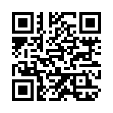

# Command-line QR Code generator
[](https://www.iso.org/standard/83389.html)
[](https://github.com/oAGoulart/qrcode/releases)
[](https://github.com/oAGoulart/qrcode/tree/master?tab=MS-RL-1-ov-file)
[](https://doi.org/10.5281/zenodo.15851589)

**Objective:** Model 2, byte mode, from version 1 to 5, with EC level L, as specified in ISO/IEC 18004:2024. There are no dependencies, generator can be built from code on Windows and Linux. Output inline, bitmap, or vectors.

**Available generation:**

 **Version**            | 1    | 2    | 3    | 4    | 5    
----------------------: | ---- | ---- | ---- | ---- | ----
 **Capacity (chars)**   | 17   | 32   | 53   | 78   | 106 

> [!NOTE]
> Generator will auto-select smallest Version possible. Unless option `-v` specified.

**Pre-generated lookup tables:**
1. Reed-Solomon EC generator polynomials.
1. Galois field of 256 (285 primitive) log and anti-log table.
1. Placement index of each data and error correction bit on the encoding region.

**Options available:**

```text
Usage: qrcode [OPTIONS] <data to encode>
OPTIONS:
        --nocopy     do not print copyright header
        --verbose    print runtime information for generated values
        --raw        print generated matrix as 1's and 0's (no Unicode)
        --noinline   do not print any inline code, disregards --raw
        -m <N>       force N mask output, regardless of penalty; N:(0-7)
        -v <N>       tries to force use of N version QR Codes; N:(1-5)
        -s <N>       scale image output by N times; N:(1-30)
        -B <STR>     create STR bitmap file with generated code
        -V <STR>     create STR scalable vector image, disregards -s
```

## Usage examples

### 1. Inline printing

**Command-line:** 
```bash
qrcode oagoulart.github.io/rambles/keep-thyself-credible
```

**Output:**
```bash

    █▀▀▀▀▀█ ▄█  █▄▀▄█▀▀▀█ █▀▀▀▀▀█
    █ ███ █ ▄█  █▄█▀▄▄    █ ███ █
    █ ▀▀▀ █ ▄█  ▀ ▄▄▀▄█▀▀ █ ▀▀▀ █
    ▀▀▀▀▀▀▀ ▀▄▀ ▀ █▄▀ █▄▀ ▀▀▀▀▀▀▀
    █████ ▀█▀█ ▄▀█▀ ▄█▄▄█▀▄█▄█▄█▄
    ▄██▀ ▀▀ ██  ▀ ▀█▄ ▄▄█▄ ▀▀█▀ ▄
    ▄▀▄ █ ▀▀ ▀ █▀▀▀▀█▀▄█ ▄▄▄▄█▀▄▄
     ▀  ▀ ▀▀█▄▄▄█▀▀██  ▄██▀█▄█   
    ▄▄▀▀█ ▀█ ▀█▄▀█   ▀ █▄ ▄▄▄▄██▄
    █ █▄██▀█▄▄▄ ▄ ██ ▀▀ ▀  ▄ ▄  ▄
    ▀  ▀▀▀▀▀█▄ █▀▀▀▀███▀█▀▀▀█ ▀▄█
    █▀▀▀▀▀█ ▀█  ▀▀▄██▀ ██ ▀ ██   
    █ ███ █ ██▀▄▀▀█▀▄█▄ █▀▀▀▀▀▀▀▄
    █ ▀▀▀ █ █▄▀  ▀ ██▀▀▀██▀ █▄▀█ 
    ▀▀▀▀▀▀▀ ▀▀▀ ▀▀▀▀ ▀   ▀▀▀▀▀▀  

```

### 2. Bitmap generation

**Command-line:** 
```bash
qrcode -s 6 -B gen.bmp oagoulart.github.io/rambles/keep-thyself-credible
```

**Output:**



### 3. Vector graphics generation

**Command-line:** 
```bash
qrcode -V gen.svg oagoulart.github.io/rambles/keep-thyself-credible
```

**Output:**


## Contributing

All contributions that furthers this project's **objective** (see above) are welcome.
As of right now, this project needs quantitative testing of generated QR codes.

How to contribute with **testing**:
1. Compile the code with `make` (use MinGW or other on Windows);
1. Generate _at least_ two QR codes for each version (see characters capacity above) and try to scan it with your mobile device;
1. Open an issue in this repo with your results (even if all scans succeeded).

How to contribute with **code**:
1. Before opening any PR, create an issue discussing your proposed changes and why they are necessary (e.g. better design pattern);
1. Compile on Windows and Linux before pushing the code;
1. If your code does anything with heap memory, make sure to run it through [Valgrind](https://valgrind.org).

## Disclaimer
QR Code, iQR Code SQRC and FrameQR are registered trademarks of DENSO WAVE INCORPORATED in Japan and in other countries.

ISO/IEC 18004:2024 - Information technology — Automatic identification and data capture techniques — QR Code bar code symbology specification is &copy; ISO/IEC 2024 – All rights reserved.

## Further reading

1. [BMP file format](https://gibberlings3.github.io/iesdp/file_formats/ie_formats/bmp.htm)


