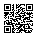

# Command-line QR Code generator
[](https://www.iso.org/standard/83389.html)
[](https://github.com/oAGoulart/qrcode/releases)
[](https://github.com/oAGoulart/qrcode/tree/master?tab=MS-RL-1-ov-file)
[](https://doi.org/10.5281/zenodo.15851589)

**Objective:** Model 2, from version 1 to 5, with EC level L, as specified in
ISO/IEC 18004:2024. There are no dependencies, generator can be built from code
on any platform. Output inline (stdout), bitmap, or vectors (svg).

**Available generation:**

|              **Version** | 1  | 2  | 3  | 4  | 5   |
|-------------------------:|----|----|----|----|-----|
| **Capacity (codewords)** | 17 | 32 | 53 | 78 | 106 |

> [!NOTE]
> Generator will auto-select the smallest Version possible. Unless option `-u` specified.
> Here, codeword refers to a full byte.
> Numeric encoding uses up to 10-bits for 3 digits (~58% reduction).
> Alphanumeric encoding uses up to 11-bits for each pair of characters (~31% reduction).

**Pre-generated lookup tables:**
1. Reed-Solomon EC generator polynomials.
2. Galois field of 256 (285 primitive) log and anti-log table.
3. Placement index of each data and error correction bit on the encoding region.

## Usage

**Options available:**

```text
Usage: qrcode [OPTIONS] <data to encode>
OPTIONS:
  --nocopy     omit copyright header from inline printing
  --noinline   do not print any inline code, disregards --raw
  --optimize   reduce data size, encode numeric, alphanumeric, byte
                 segments separately (if any)
  --raw        print generated code with chars 1, 0 (no box-chars)
  --verbose    print runtime information for generated values
  --version    show generator's version and build information
  -m <uint>    force choice of mask <0-7>, regardless of penalty
  -u <uint>    scale image output <1-30> times
  -s <uint>    force use of version <1-5> code (or lower, if
                 used with --optimize)
  -B <string>  create bitmap file with generated code
  -K <string>  create scalable vector image, disregards -s
```

### Building and binaries

Latest (stable) releases can be found at this repo's [Releases](https://github.com/oAGoulart/qrcode/releases).
To build this project, use `make`. Otherwise, as long as your system has
Clang and Python, you may run Makefile's build commands manually.

> [!CAUTION]
> This repo's `master` branch may or may not contain uncompilable, unstable code.
> It's recommended that you select the latest tag release,
> unless you wish to collaborate with code.

**Build tools used for binaries:**

     Tool | Ubuntu 22.04<br>amd64/x86<br>(WSL 2) | Windows 11<br>amd64<br>(MSYS2) | FreeBSD 14.3<br>x86<br>(VM) | macOS 14<br>aarch64<br>(VM) | OmniOS r151054<br>amd64<br>(VM)
---------:| :----: | :----: | :----: | :----: | :----:
 GNU Make | 4.3 | 4.4 | 4.4.1 | 4.4.1 | 4.4.1
    Clang | 14.0.0 | 20.1.8 | 19.1.7 | 15.0.0 | 20.1.7
   Python | 3.10.12 | 3.12.6 | 3.11.13 | 3.13.7 | 3.13.3
 *status* | 🟩 | 🟩 | 🟩 | 🟩 |  🟩

### Examples

#### 1. Inline printing

**Command-line:** 
```bash
qrcode oagoulart.github.io/rambles/keep-thyself-credible
```

**Output:**
```bash

    █▀▀▀▀▀█ ▄█  █▄▀▄█▀▀▀█ █▀▀▀▀▀█
    █ ███ █ ▄█  █▄█▀▄▄    █ ███ █
    █ ▀▀▀ █ ▄█  ▀ ▄▄▀▄█▀▀ █ ▀▀▀ █
    ▀▀▀▀▀▀▀ ▀▄▀ ▀ █▄▀ █▄▀ ▀▀▀▀▀▀▀
    █████ ▀█▀█ ▄▀█▀ ▄█▄▄█▀▄█▄█▄█▄
    ▄██▀ ▀▀ ██  ▀ ▀█▄ ▄▄█▄ ▀▀█▀ ▄
    ▄▀▄ █ ▀▀ ▀ █▀▀▀▀█▀▄█ ▄▄▄▄█▀▄▄
     ▀  ▀ ▀▀█▄▄▄█▀▀██  ▄██▀█▄█   
    ▄▄▀▀█ ▀█ ▀█▄▀█   ▀ █▄ ▄▄▄▄██▄
    █ █▄██▀█▄▄▄ ▄ ██ ▀▀ ▀  ▄ ▄  ▄
    ▀  ▀▀▀▀▀█▄ █▀▀▀▀███▀█▀▀▀█ ▀▄█
    █▀▀▀▀▀█ ▀█  ▀▀▄██▀ ██ ▀ ██   
    █ ███ █ ██▀▄▀▀█▀▄█▄ █▀▀▀▀▀▀▀▄
    █ ▀▀▀ █ █▄▀  ▀ ██▀▀▀██▀ █▄▀█ 
    ▀▀▀▀▀▀▀ ▀▀▀ ▀▀▀▀ ▀   ▀▀▀▀▀▀  

```

> [!TIP]
> Using a `line-height` of `1em` (i.e. line height is equal to font size)
> will remove the unintended vertical spacing seen in the output above.
> Some fonts may require a slight different value between `1 +/- .25`.
> You can also try value `normal`.

#### 2. Bitmap generation

**Command-line:** 
```bash
qrcode -s 6 -B gen.bmp oagoulart.github.io/rambles/keep-thyself-credible
```

**Output:**


#### 3. Vector graphics generation

**Command-line:** 
```bash
qrcode -K gen.svg oagoulart.github.io/rambles/keep-thyself-credible
```

**Output:**



## Roadmap

Planned features:
1. encoding switching (100%, next release)
2. higher EC levels (TBD)
   - [ ] lookup tables
   - [ ] codewords splitting
3. higher Version codes (TBD)

## Disclaimer
QR Code, iQR Code SQRC and FrameQR are registered trademarks
of DENSO WAVE INCORPORATED in Japan and in other countries.

ISO/IEC 18004:2024 - Information technology — Automatic identification and
data capture techniques — QR Code bar code symbology specification is &copy;
ISO/IEC 2024 – All rights reserved.

## Further reading

1. [BMP file format](https://gibberlings3.github.io/iesdp/file_formats/ie_formats/bmp.htm)
2. [Scalable Vector Graphics (SVG) 1.1 (Second Edition)](https://www.w3.org/TR/SVG11/)
